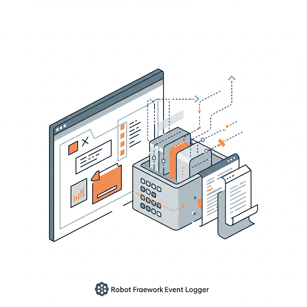
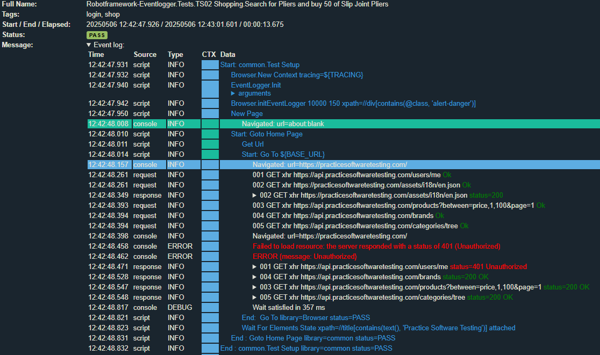
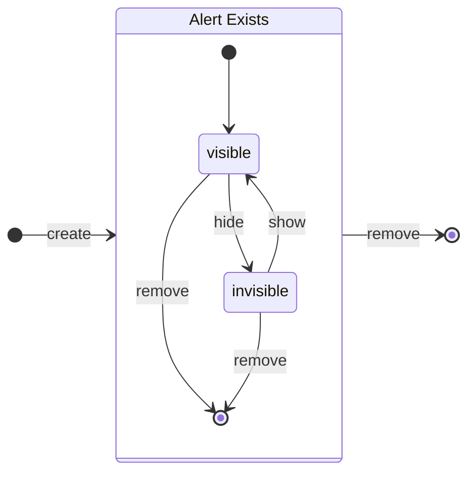

# Robot Framework Event Logger




**The situation**: Robot Framework is a versatile and user-friendly test automation framework, known for its keyword-driven approach that simplifies test script creation. However, testing modern `asynchronous` web applications, particularly those built with frameworks like Angular and React, can present challenges.

**The challenge:** Web applications rely heavily on JavaScript to dynamically update page content by fetching data from backend services in the background. This `asynchronous` behavior makes it difficult for traditional test automation techniques to reliably interact with and verify the application's state.

**The solution**: Robot Framework Event Logger addresses these challenges by providing a dedicated set of tools and custom keywords designed to enhance your testing capabilities for `asynchronous` web applications. This library also offers deeper insights into the dynamic behavior of your application, enabling more robust and reliable test automation.

**In this repository, you will find:**

* The source code for the Robot Framework Event Logger library.
* An example project demonstrating how to effectively utilize the provided keywords and tools in a real-world scenario.

> [!NOTE]
> We encourage you to explore the code and the example project to understand how the Event Logger can help you overcome the complexities of testing asynchronous web applications with Robot Framework.

For my Thai friends: ตัวบันทึกเหตุการณ์ (Event Logger) มีชุดเครื่องมือและคีย์เวิร์ดต่างๆ เพื่อแก้ไขปัญหาเกี่ยวกับพฤติกรรมแบบอะซิงโครนัส (asynchronous behavior) และช่วยให้เข้าใจพฤติกรรมของเว็บแอปพลิเคชันของคุณได้ลึกซึ้งยิ่งขึ้น ใน repository นี้ คุณจะพบทั้งโค้ดและโปรเจกต์ตัวอย่างเพื่อให้คุณสามารถทดลองใช้งานทุกอย่างได้

Read more in my blog: [De Uitdaging van Flaky Tests in Moderne Webapplicaties](https://tauvicr.wordpress.com/2025/04/02/de-uitdaging-van-flaky-tests-in-moderne-webapplicaties/)

## What does Event Logger do?

The Event Logger leverages the power of the Browser (Playwright) Library to provide enhanced testing capabilities. It comprises a Python library offering additional keywords, a listener interface for seamless integration with your tests, and JavaScript code injected into the browser to collect crucial data. Importantly, it supports all browsers compatible with Playwright.

The Event Logger offers the following key services:

* **Collect and Log Web App Events:**
    * Asynchronous API requests, providing visibility into background data fetching.
    * Web application alerts and messages, capturing important user interactions and notifications.
    * Web application console logging, allowing you to track JavaScript errors and debugging information.
* **Synchronize Test Activity with Events:** Enables your test scripts to intelligently wait for specific events to occur before proceeding, ensuring stability and preventing premature interactions.
* **Enable Event-Based Assertions (Future Feature):** Laying the groundwork for future capabilities to directly assert on the occurrence and details of logged events.
* **Generate Contextual Reports:** Creates comprehensive reports that integrate scripted test actions with the recorded events, providing a clear timeline and understanding of application behavior during testing.

Integrating the Event Logger into your existing Robot Framework test scripts requires **minimal modifications**, allowing you to quickly benefit from its advanced features.

## Supporting javascript frameworks

Our goal is to support testing modern web applications built with popular JavaScript frameworks such as React, Angular, and Vue.js.

We are currently exploring the most effective strategy for handling the unique characteristics of each framework. This includes evaluating whether a generic approach can adequately capture the necessary events and ensure reliable synchronization, or if framework-specific solutions would offer a more robust and accurate testing experience.

Key considerations in this investigation include:

* **Generic vs. Specific Solutions**: Determining if a unified mechanism can effectively address the asynchronous patterns and event handling conventions of all target frameworks, or if tailored implementations for React, Angular, and Vue.js are required for optimal performance and accuracy.
* **Framework Identification**: Exploring methods for the Event Logger to automatically identify the JavaScript framework used by the application under test. This could involve analyzing specific DOM structures, global variables, or other framework-specific indicators. Alternatively, we are considering whether requiring the user to explicitly specify the framework as a parameter during initialization would be a more reliable approach.


We are committed to finding the solution that offers the best balance of ease of use, reliability, and comprehensive event capture for testing modern web applications built with these leading JavaScript frameworks. Your feedback and insights on this topic are highly valued as we move forward.

# How to use the Event Logger?

## 1. Add the Event Logger to your Test Suite

The core of the Event Logger currently consists of two essential files: `EventLogger.py` (the Python library) located in `resources/EventLogger.py`, and `Eventlogger.js` (the browser extension in JavaScript) found at `resources/Eventlogger.js`. You need to include these files within your project structure.

Import both the Browser library and the Event Logger library into your Robot Framework test suite. Add the following lines to your `.robot` or `.resource` file:

```robot
*** Settings ***
Library           Browser         jsextension=${CURDIR}/EventLogger.js
Library           EventLogger
```

In my project, I utilize a common.resource file (located at resources/common.resource) to manage such imports.

## 2. Initialize the Event Logger
The Event Logger operates by collecting and managing events within the scope of a Playwright Browser Context and an individual test case. Optional reporting of these events occurs after each test execution.

For optimal performance and correct operation, ensure that the Playwright Browser Context is initialized before initializing the EventLogger immediately afterward:

```robot
Test Setup
    [Documentation]    Open Browser Home Page
    Browser.New Context    tracing=${TRACING}
    EventLogger.Init   waitAfter=Browser.Click, Browser.Go To
    ...                alerts=xpath=//div[contains(@class, 'alert-danger')]  logLevel=INFO
```
Arguments for EventLogger.Init:

* `maxWait=10000`: The maximum timeout in milliseconds to wait for events to settle.

* `minIdle=150`: The minimum time in milliseconds of inactivity (no new API requests) to consider events settled.

* `waitAfter=null`: A comma-separated list of Robot Framework keywords. The Event Logger will automatically wait for events after the execution of these specified keywords.

* `alerts=null`: A locator (e.g., XPath) to identify elements on the page that represent application alerts or error messages. These will be specifically tracked and included in the reports.

* `logLevel=INFO`: sets the logged events to DEBUG, INFO, WARN, ERROR or NONE

## 3. Report the Events
To generate a report of all collected events and alerts after each test, add the EventLogger.Report keyword to your test teardown:

```robot
Test Teardown
    [Documentation]    Test Teardown
    EventLogger.Report Event Logging
    Run Keyword If Test Failed    Take Screenshot    fullPage=True
```

## 4. Utilize WaitForEvents for Synchronization
In many scenarios, configuring the waitAfter argument during EventLogger.Init will be sufficient to ensure your tests wait for API requests to complete after specific actions like navigating to a new page `Browser.Go To` or clicking buttons/links `Browser.Click`. The Event Logger's listener interface automatically inserts a `WaitForEvents` call after these specified keywords.

```robot
# Notice we have removed waitAfter from the Init
EventLogger.Init  alerts=xpath=//div[contains(@class, 'alert-danger')]

# Somewhere in your script
# Click the login button
${l_button}    Get Element By Role    button    name=Login    exact=true
Click    ${l_button}

# The Event Logger automatically waits for API requests to settle after the Click
# Now you can reliably interact with the UI as it should be stable
```

However, for more granular control over when to wait for events, you can explicitly use the Wait For Events keyword within your test script:

```robot
# Notice we have removed waitAfter from the Init
EventLogger.Init  alerts=xpath=//div[contains(@class, 'alert-danger')]

# Somewhere in your script
Wait For Events
# You can now perform assertions on the stable UI
```

## 5. View the Logs
After executing your tests, detailed logs of the collected events are generated in the results folder. Open the `log.html` file in your web browser to access a comprehensive overview of the logged events, providing valuable context for your test execution.



## 6. Customizing the Event Logger
For users with specific needs, the Event Logger offers extensibility. If you need specific functionalities, you can extend the Python and JavaScript functions. Add your own functions to `EventLogger.py` and use them in your tests.

# Testing the Event Logger

Testing the Event Logger presents some unique challenges. My approach focuses on verifying the reliability of web application behavior, especially under adverse conditions.  I primarily achieve this by:

* **Simulating a slow network:** By configuring `${NETWORK_SPEED}` to "Slow 3G" in `common.resource`, I intentionally introduce latency to API requests.
* **Repeating tests extensively:** I run the same test suite (e.g., shopping tests) many times (30+) to expose potential edge cases and race conditions.

My observations include:

* As expected, the slow network simulation significantly increases API response times (up to 3 seconds).  The Event Logger effectively captures these slow responses, and the tests generally pass reliably under these conditions.
* However, with repeated test executions, I've encountered intermittent internal server errors from the API.  These errors are not consistently handled by the web application, as evidenced by the lack of corresponding alerts in the UI.

Based on these findings, I believe:

* The Event Logger fulfills its core purpose of capturing and reporting asynchronous events, particularly network-related ones.
* To improve test coverage, future efforts should include simulating server-side errors (e.g., 500 Internal Server Error) and verifying that the web application handles them gracefully (e.g., displaying user-friendly alerts).

In summary, while the Event Logger effectively monitors application behavior under normal and slow network conditions, additional test scenarios simulating server errors are needed to ensure comprehensive testing.

# Work in progress

The Event Logger follows a generic and holistic testing philosophy.  Rather than creating specific test scripts for every situation, it emphasizes triggering application behavior and then capturing all UI and API events in a comprehensive event log. This log is subsequently used to evaluate whether the application behaved as expected.

This approach necessitates the continuous or frequent collection of diverse information into a buffer.  Evaluations occur at designated "stable" points, focusing on:

* **Expected events:** Events that *should* occur.
* **Undesired events:** Events that should *not* occur.
* **Unexpected events:** Events that fall into a gray area.

This methodology enables a data-driven testing approach, potentially leveraging decision tables.

Current work in progress:

- [x] Add support for reporting logLevel
- [ ] Add alert handling
- [ ] Add mechanism for detecting javascript framework

## wait for Events

The wait for Events function waits for the application to be stable with a timeout. Currently we use a generic approach but we could also use framework specific approaches. This may be better and requirers further investigation.

angular: https://angular.dev/api/core/Testability

Find out if this will work and if there are more frameworks that have similar solutions.

## Alert logging

I'm currently developing a system for logging alerts and messages, which requires a generic model for their description and classification. This model includes:

* **Appearance and Purpose**: How the alert is displayed and its intended function.
* **Content**: Whether it has a title and/or a text message.
* **Functionality**: Any interactive elements, such as buttons and timer effects.
* **Accessibility**: Support for accessibility standards (e.g., `aria role="alert"`).

Additionally, the system will capture triggering and timing information:

* Why and when the alert is shown.
* How long the alert remains visible.

### Identifying Alerts in HTML Content

A key challenge in logging alerts is their identification within the HTML structure. There is no single, universally defined standard or common format for alert elements. To reliably locate these elements, we need to consider various strategies:

* **ARIA Roles**: This is the preferred approach. Identify elements that explicitly declare their semantic meaning as an alert using ARIA roles (e.g., `role="alert"`)?
* **Element Names**: Should we focus on common HTML element names often used for alerts, such as `div` or custom elements like `<Alert>`?
* **CSS Classes**: Should we target elements based on specific CSS class naming conventions, such as prefixes like `alert-*` or `toast-*`?
* **Smart Combination**: Is the most robust approach a strategic combination of these methods, potentially involving prioritization or a weighted scoring system to improve accuracy and minimize false positives?

Furthermore, alerts often exhibit dynamic behavior:

* They can appear and disappear dynamically based on user interactions or application state.
* Their visibility can be time-limited.
* Dynamically added alerts might persist in the DOM even when they are no longer visually apparent to the user. This can occur in multi-page applications where a new layer or page transition obscures the underlying alert.

These complexities necessitate careful consideration and a robust identification strategy. The initial implementation will concentrate on identifying alerts within **Angular** applications, given its presence in the demo application. Support for other frameworks will be integrated in subsequent development phases.

For checking vsisibility read: https://coreui.io/blog/how-to-check-if-an-element-is-visible-in-javascript/

### Alert State Model

The lifecycle of an alert can be represented by the following state machine:



State Transitions:

* `create`: An alert instance is created in the system as a DOM element (or group of elements) and now `Exists`.
* `visible`: The alert is currently displayed and provides information to the user on the active page view.
* `hide`: The alert is temporarily hidden, often when navigating away from the relevant page view in a multi-page application. While `invisible`, the alert still `Exists` in the DOM.
* `show`: A previously hidden alert becomes visible again, typically when returning to the page view where it was initially displayed.
* `remove`: The alert is being permanently removed and destroyed.

This state model clarifies that an alert's visibility is tied to a context, the current page view. An alert can be `visible` when its associated information is relevant to the user's current context. Upon navigating away, it will become `invisible` but can reappear (`visible`) if the user returns to the relevant view. Eventually, the alert will be `removed` and `Destroyed`.

visibilium omnium et invisibilium.

### Angular framework

| Type             | Elements   |
| ---------------- | ---------- |
| Snackbar/Toast   | `<snack-bar-container>`, `<mat-snack-bar-container>`, `.mat-snack-bar-container`, `.toast`, `.snackbar` |
| Dialog/Modal     | `<mat-dialog-container>`, `.mat-dialog-container`, `<dialog>`, `.modal`, custom selectors like `<my-dialog>` |
| Alert banner     | `<div class="alert">`, `<div class="alert-success">`, `<div class="alert-danger">`, `<mat-error>`,`<mat-alert>` |
| Inline error     | `<mat-error>`, `<span class="error">`, `<div class="form-error">` |

Typical angular code examples:
```html
<!-- proper toasts alway come in a container -->
<div class='toast-container'>
  <!-- this can repeat -->
  <div class='ngx-toastr toast-info'>
    <!-- we see a proper aria label and role here -->
    <div class='toast-title aria-label='MyTitle'>MyTitle</div>
    <div class='toast-message' role='alert'>MyMessage</div>
  </div>
</div>

<!-- alerts can appear everwhere, this alert has no aria role -->
<div class='alert alert-danger'>An alert</div>

<!-- same with snackbars: usually on the corner near your house -->
<simple-snack-bar class="mat-mdc-simple-snack-bar">
  <div matsnackbarlabel="" class="mat-mdc-snack-bar-label mdc-snackbar__label">
    Disco party!
  </div>
 <div matsnackbaractions="" class="mat-mdc-snack-bar-actions mdc-snackbar__actions">
    <button mat-button="" matsnackbaraction="" class="mat-mdc-snack-bar-action mdc-snackbar__action     mdc-button mat-mdc-button mat-unthemed mat-mdc-button-base" mat-ripple-loader-class-name="mat-mdc-button-ripple">
      <span class="mat-mdc-button-persistent-ripple mdc-button__ripple"></span>
      <span class="mdc-button__label"> Dance </span>
      <span class="mat-focus-indicator"></span>
      <span class="mat-mdc-button-touch-target"></span>
      <span class="mat-ripple mat-mdc-button-ripple"></span>
    </button>
  </div>
</simple-snack-bar>
```

The Shop application is also based on Angular and has a weird structure. Its not even user friendly and there fore not compliant.

```html
<!-- Plain message bit weird formatting not even a proper message just visible text -->
<div class='ng-star-inserted'>Some message</div>
```

```
04:47:54.724 console	INFO	Alert: Created {alert: 1, class: toast-success, visible: false, shown: 0, text: Product added to shopping cart.}
04:47:54.775 console	INFO	Alert: Updated {alert: 1, class: toast-success, visible: true, shown: 0, text: Product added to shopping cart.}
04:48:00.027 console	INFO	Alert: Updated {alert: 1, class: toast-success, visible: false, shown: 5251, text: Product added to shopping cart.}
04:48:00.078 console	INFO	Alert: Cleared all alerts
```

> [!NOTE] 
> *The web application that we use for testing our framework sometimes creates a weird and unstructured message format. The `European Accessibility Act (EAA)` is a European Union directive ([EU 2019/882](https://commission.europa.eu/strategy-and-policy/policies/justice-and-fundamental-rights/disability/union-equality-strategy-rights-persons-disabilities-2021-2030_en)) that aims to harmonize accessibility requirements for a range of products and services, making them more accessible to persons with disabilities and older people.*

### React framework

```html
<Alert icon={<CheckIcon fontSize="inherit" />} severity="success">
  Here is a gentle confirmation that your action was successful.
</Alert>
```

### Model:
* type: alert | toast | snackbar (we use the type name as defined by the framework itself)
* class:  info | warning | error | danger | success (we use the class name as defined by the framework itself)
* title: optional  
* message: required

Challenges: are these elements visible or not? Complex css and javascript dynamics can make things invisible.

Test environments for alerts
* React
* Angular:
  * https://ngx-toastr.vercel.app/
  * https://material.angularjs.org/latest/demo/toast
* Vue.js
